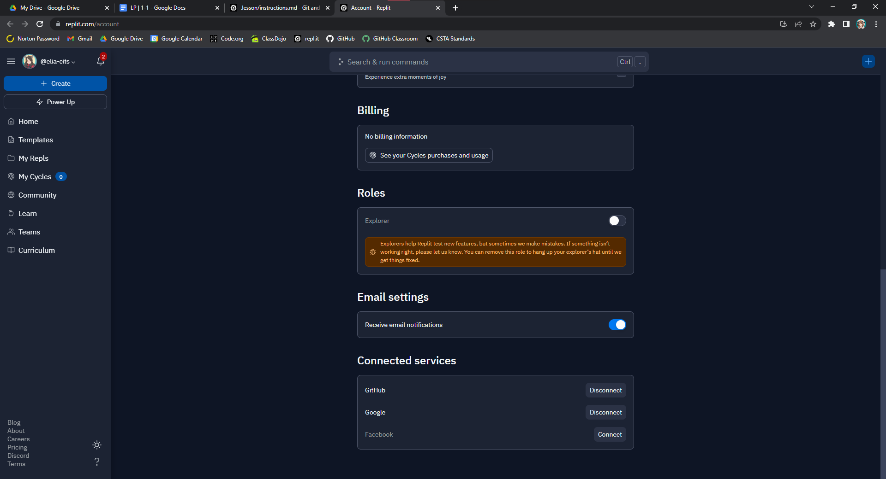

# Instructions

Be sure to read and follow these instructions closely and carefully when completing this project. It is important that you properly connect your Github account with Repl.it in order to complete this project.

## Step 1 | Connecting your Github Account

The first step is for us to connect our Github and Repl.it accounts. To do this is pretty simple.

1. Navigate to your account settings by clicking your name at the top left of the page, and then selecting account.

2. Scroll to the bottom of your account settings to the section labeled **Connected Services**.

3. Where it says **Github**, select connect.
4. Follow any instructions provided on-screen in order to connect your account. You will need your Github username and password.

## Step 2 | Creating our Github Repository

Next we are going to create out Github Repository from Github Classroom.

1. Follow this link to the Github Classroom Assignment: Git & github Fundamentals - https://classroom.github.com/a/T2qhFOB6

</img>

2. Select **Accept this assignment**. You may need to wait a few seconds for Github to automatically generate your repository. Once you've waited, refresh the page, and you should be greeted with a page giving you a link to your Github repository. Open this.

</img>

</img>

3. Last, we will need to copy the repository URL. This can be done by copying the link under the green Code button.

</img>

</img>

## Step 3 | Cloning the Repository to repl.it

1. Navigate back here to your repl.it project, and select the Version Control button on the left hand control panel. It is the button that looks like a fork.

</img>

2. Select **Exisiting Git repo?**.
3. Paste the link to your Github Repository where it says **Choose a Repository to import**, and then hit **Pull Changes**.

</img>

4. It may take a second, but once you've cloned the repository, a README.md file should appear in your project. Open it, along with the preview.

## Step 4 | Modifying the README.md

The file you are looking at is what is known as a Markdown File. Markdown files are essentially text files, with some added functionality in order to make documents. You can read about Markdown files here: https://www.markdownguide.org/

You should also see a file named **.gitignore**. DO NOT MODIFY OR REMOVE THIS FILE.

1. In your README.md file, add the following to the bottom of the page:
    1. Your first name.
    2. Three interesting things about yourself.
       - These can be hobbies, interests, or really anything you'd like to write here.
       - You should add these using a list. Check the markdown guide above on how to make a list. It's pretty easy.
    3. A short term goal that you wish to accomplish with Python.
    4. A long term goal that you wish to accomplish with Python.

## Step 5 | Pushing your Repository

Finally, we are going to push the changes to our repository to Github.

1. Open the Version Control menu if it is not already open.
2. Write your commit message. This message should detail what changes you've made to your repository. You can simply write "Modified README.md" for this commit.
3. Finally, hit commit and push. Once this has finished, check your github repository to make sure the changes have been pushed. You may need to refresh the page.

</img>

Congratulations, you've just updated your first Github Repository! Well done!

Remember to keep the reference materials for these tools close, you will need them in the future.